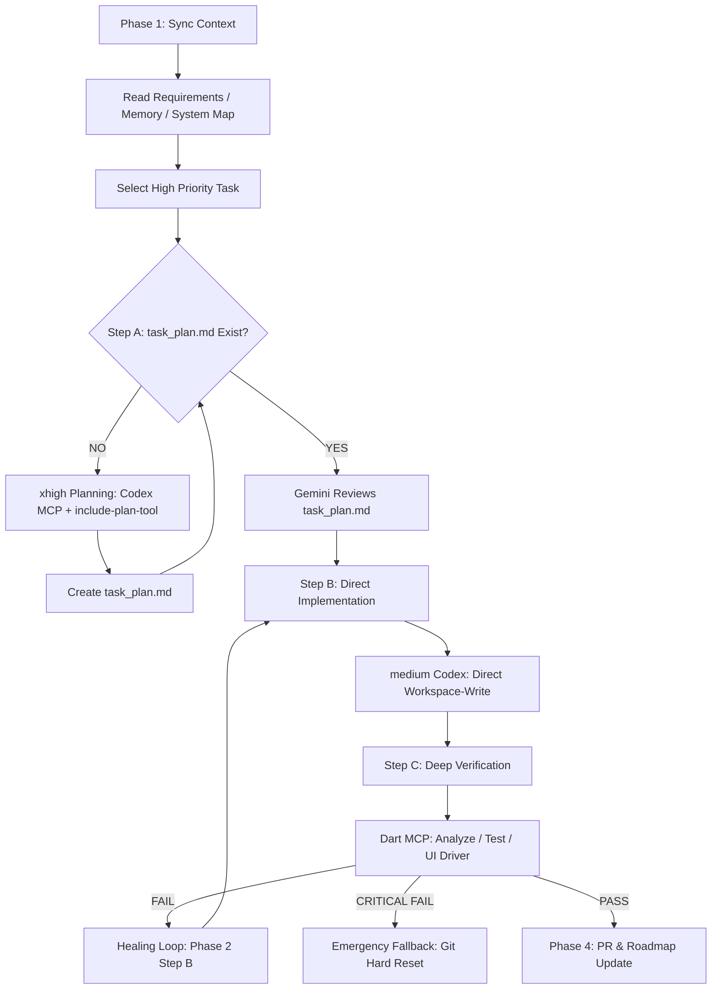
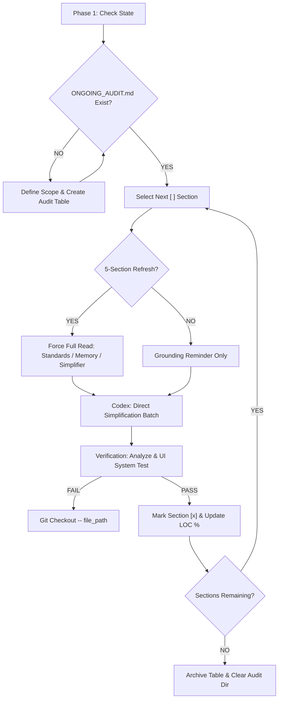

# The Agent's Guide (`.agents/`) - Prototype

> [!IMPORTANT]
> This framework is a **prototype** and is designed to work exclusively with **Codex as an MCP-server**.

This folder is the "Brain" of the **Gemini Codex Multi-Agentic Framework**. It serves as your primary **Instruction Book** and **Map**. Before doing anything, you must read this file to understand the current architecture and protocols.

## 🗺️ Directory Map

```text
.agents/
├── docs/                # THE TRUTH: Long-term architectural & design docs
│   ├── PROJECT_MEMORY    # History, strategy, and "Lessons Learned"
│   ├── PROJECT_STANDARDS # Coding laws & UI/UX tokens (Radius 32)
│   ├── SYSTEM_MAP       # Screen-to-Logic wiring diagrams
│   └── PROJECT_ROADMAP  # High-level feature milestones
├── workflows/           # THE ENGINES: Step-by-step automation guides
│   ├── super_agent_harness # Feature implementation engine
│   └── deep_audit         # Tech-debt cleanup engine
├── rules/               # THE POLICE: Critical operating rules for agents
│   ├── antigravity-agent-rules.md
│   └── codex-orchestration-rules.md
├── requirements.json    # THE QUEUE: Master list of all tasks/features
├── progress.txt         # THE LOG: History of session activities
└── README.md            # THIS FILE: Your entry point and map
```

---

## 1. Who Does What?

| Role | Name | Responsibility |
| :--- | :--- | :--- |
| **Architect** | **Me (Chat)** | I talk to you, update docs, define requirements, and manage the team. |
| **Builder** | **Codex** | The "Hands". It reads the implementation plan and writes the code. |
| **Tools** | **MCP Servers** | Connections (Codex, Dart, GitHub, Firebase) that empower Me to build directly. |

### MCP Server Stack
The `.agents` folder relies on the following native protocol connections:
- **`codex-mcp-server`**: Executes the implementation logic (Builder).
- **`dart-mcp-server`**: Provides deep diagnostics, testing, and Dart/Flutter analysis.
- **`github-mcp-server`**: Manages PRs, Issues, and version control governance.
- **`firebase-mcp-server`**: Validates backend state, Firestore rules, and Auth config.
- **`stitch-mcp-server`**: Bridges the gap between UI designs and living code.

---

## 2. Important Files (The "Truth")

These files define *what* we are building. The structure of these files is finalized to ensure consistency, though content grows as we build.

### A. [`docs/PROJECT_MEMORY.md`](./docs/PROJECT_MEMORY.md) (The Storage)
**Purpose**: Long-term strategic memory and historic context. 
**Sections**:
1.  **Project Strategy**: Core framework and architecture choices.
2.  **Design Law**: Details of specific UI/UX aesthetics and tokens.
3.  **Business Logic**: Core domain logic and critical rules.
4.  **Feature Blueprint**: High-level functionality definitions.
5.  **Implementation History**: Monthly log of major engineering shifts.
6.  **Security Protocol**: Secrets management and sensitive file handling.
7.  **Lessons Learned & Discoveries**: Documentation of "Gotchas" and specific technical fixes.

### B. [`docs/PROJECT_STANDARDS.md`](./docs/PROJECT_STANDARDS.md) (The Law)
**Purpose**: Absolute coding and UI quality rules.
**Sections**:
1.  **Core Philosophy**: Minimalist vs. premium design goals.
2.  **Agent Workflow Standards**: The "Triple-Check" lifecycle details.
3.  **Tech Stack Mastery**: Mandatory versions and patterns for the chosen framework.
4.  **Documentation Rules**: Protocol for updating the brain files.
5.  **Testing & Mocking Standards**: Rules for Firestore and Auth testing.
6.  **Agent Discovery & Recovery Protocol**: The Two-Strike rule and grounding laws.

### C. [`docs/SYSTEM_MAP.md`](./docs/SYSTEM_MAP.md) (The Wiring)
**Purpose**: Connects UI screens to their backend services to prevent logic breaks.
**Sections**:
- **Feature-Based Mapping**: Maps each major feature, linking Screen -> Logic -> Provider/Controller.
- **Layout Dependencies**: Global theme and scaffold architecture.

### D. [`docs/PROJECT_ROADMAP.md`](./docs/PROJECT_ROADMAP.md) (The Vision)
**Purpose**: Phase-based progress tracking.
**Sections**:
- **Phase 1-N**: Checklists of completed vs. pending high-level engineering goals.

---

## 3. Workflows (The "Engines")

These are the instructions for standard automation processes.

*   [`workflows/init_project.md`](./workflows/init_project.md):
    *   **The Starter**: Brainstorms with the user and initializes the core project documentation (`PROJECT_ROADMAP.md`, `PROJECT_STANDARDS.md`, `PROJECT_MEMORY.md`, and `requirements.json`).
*   [`workflows/super_agent_harness.md`](./workflows/super_agent_harness.md):
    *   **The Main Engine**: Implements features from `requirements.json`.
    *   **Logic**: Plan (xhigh) -> Code (medium) -> Verify (Gatekeeper).
*   [`workflows/deep_audit.md`](./workflows/deep_audit.md):
    *   **The Cleanup Specialist**: Refactors and simplifies existing code to reduce tech debt.
*   [`workflows/define_feature.md`](./workflows/define_feature.md):
    *   **The Architect's Protocol**: Standardizes how a new idea becomes a set of requirement tasks.

### 📋 Standard for New Workflows
Every workflow in `.agents/workflows/` must follow this creation standard:
1.  **Format**: Use `.md` files with YAML frontmatter containing `description` and `trigger`.
2.  **Logic Synchronization**: If the workflow touches new parts of the app, update `docs/SYSTEM_MAP.md`.
3.  **Cross-Reference**: Always read `PROJECT_STANDARDS.md` before writing a workflow to ensure correct tool-usage (e.g., using `run_tests` instead of raw shell commands).
4.  **Indexing**: Add the new workflow to the lists above in this `README.md` immediately.

> [!IMPORTANT]
> **Markdown vs. XML Formatting Rule:**
> When writing `.md` workflow or instruction files, **always use standard Markdown headers** (`## Role`, `## Instructions`) to structure the file. Do NOT wrap markdown sections in XML tags (like `<role>...</role>`).
> However, when defining strings for **raw prompt inputs** sent to an LLM (e.g. inside a tool call's `prompt` parameter), you **MUST** use Anthropic-style XML tags (`<task>`, `<context>`) to bound variables and format the instructions.

---

## 4. Workflow Technical Guide

This section provides a detailed technical breakdown of the two primary orchestration engines.

### A. Super-Agent Harness


### B. Deep Audit & Simplifier


---

## 5. The Agent Grounding (Wake-up Protocol)

Whenever you start a task or "wake up" in this workspace, you MUST follow these grounding rules:
1.  **Map**: Read this `README.md` to find where the relevant information lives.
2.  **Laws**: Check `docs/PROJECT_STANDARDS.md` and `docs/PROJECT_MEMORY.md` for specific design (Radius 32) and discovery constraints.
3.  **Task**: Read `requirements.json` and `progress.txt` to understand the current engineering focus.

---

## 6. Emergency Recovery Protocol
If the state of the codebase becomes unrecoverable through standard "Healing" (bug fixing), the workflows provide a hard reset:
- **Command**: `git reset --hard HEAD` or `git checkout -- .`
- **Trigger**: 2 consecutive failed attempts to fix a breaking budget or analysis error.

